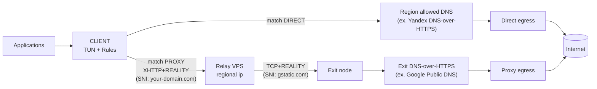

# xray-core double-hop

Example configs for a two-hop **xray-core** setup: client → relay (regional/residential IP, XHTTP + REALITY behind nginx) → exit node (TCP + REALITY) → internet. Includes sample server configs and client routing for Shadowrocket

## Architecture Overview



## Repository layout

| Path | Purpose |
|------|---------|
| `xray_relay_server.example.json` | Relay node xray config (client inbound + hop to exit) |
| `xray_exit_server.example.json` | Exit node xray config |
| `nginx_relay_server.example.conf` | Relay nginx: TLS termination for REALITY fallback and site masquerade |
| `shadowrocket/routing.conf` | Shadowrocket routing/DNS rules (RU direct, rest via proxy) |
| `shadowrocket/rule-sets/` | Optional rule sets (e.g. ad blocking) |
| `user-configs/` | Your edited copies (gitignored); create subdirs before copying examples |

## Prerequisites

- Two VPS (about 1 vCPU / 1 GB RAM each is enough for ~10 users): **relay** with a regional or residential IP, **exit** elsewhere.
- One domain (a “residential-looking” TLD can help for the first hop SNI).
- Debian on both nodes (small disk footprint).
- Firewall: only **22** (SSH) and **443** (proxy) open on both; keep **80** closed if you issue certificates via DNS.

## Setup

### 1. Prepare both VPS

Update packages, enable SSH keys, and restrict the firewall as above.

### 2. Install xray-core

On **relay** and **exit**, using the [official install script](https://github.com/XTLS/Xray-install):

```bash
sudo bash -c "$(curl -L https://github.com/XTLS/Xray-install/raw/main/install-release.sh)" @ install
```

Default config path: `/usr/local/etc/xray/config.json`.

### 3. Relay: nginx and TLS certificate

Install nginx according to the [official instruction](https://nginx.org/en/linux_packages.html#Debian).

Issue a Let’s Encrypt certificate with **acme.sh** and a **DNS challenge** (so port 80 stays closed). Replace `dns_your_provider` with your DNS plugin, per [acme.sh DNS API](https://github.com/acmesh-official/acme.sh/wiki/dnsapi):

```bash
curl https://get.acme.sh | sh
alias acme.sh=~/.acme.sh/acme.sh
acme.sh --upgrade --auto-upgrade
acme.sh --set-default-ca --server letsencrypt
acme.sh --issue -d your-domain.com --dns dns_your_provider --keylength ec-256
chown -R nobody:nogroup /root/.acme.sh
```

### 4. Clone this repo

```bash
git clone https://github.com/gndvrn/xray-double-hop.git
cd xray-double-hop
mkdir -p user-configs/relay-servers user-configs/exit-servers
```

Edit files locally in `user-configs/` (or any editor); that directory is not committed.

### 5. Relay: nginx config

```bash
cp nginx_relay_server.example.conf user-configs/relay-servers/nginx_relay_server.conf
```

In `user-configs/relay-servers/nginx_relay_server.conf`:

- `server_name` — your domain (example: line 56).
- `ssl_certificate` / `ssl_certificate_key` — paths from acme.sh (example: lines 58–59).
- `$website` in `location /` — a public HTTPS site that looks plausible for your domain (used for non-proxy browser traffic to the relay; REALITY still uses your domain as SNI on the first hop).

Deploy on the relay (replaces the default main config):

```bash
scp user-configs/relay-servers/nginx_relay_server.conf root@relay:/etc/nginx/nginx.conf
ssh root@relay 'nginx -t && systemctl enable --now nginx && systemctl status nginx'
```

### 6. Generate and edit xray configs

Copy examples into `user-configs/`:

```bash
cp xray_exit_server.example.json user-configs/exit-servers/xray_exit_server.json
cp xray_relay_server.example.json user-configs/relay-servers/xray_relay_server.json
```

Replace placeholders in both files (UUIDs, X25519 keys, XHTTP path, exit IP, REALITY `serverNames` / `dest`, etc.). Generate keys with xray, for example:

```bash
xray uuid          # client / user IDs
xray x25519        # REALITY key pairs (private on server, public where needed)
```

Field-by-field details: [Xray configuration docs](https://xtls.github.io/en/config/).

**Order of work:** configure the **exit** first (its keys and client UUID), then the **relay** (relay keys + relay→exit outbound using exit’s public key and UUID).

### 7. Deploy xray on both nodes

```bash
scp user-configs/exit-servers/xray_exit_server.json root@exit:/usr/local/etc/xray/config.json
scp user-configs/relay-servers/xray_relay_server.json root@relay:/usr/local/etc/xray/config.json
```

On each server:

```bash
systemctl restart xray
systemctl status xray
```

### 8. Client

Import connection settings from the **relay** config (address, port, UUID, REALITY/XHTTP parameters). Set TLS fingerprint to **chrome** (or match what you configured on the relay→exit hop) — important for DPI evasion on the second hop.

You should end up with a working double-hop chain. It does **not** bypass IP allowlists (L3) unless the relay’s IP is allowed; on L7 it is aimed at modern DPI circumvention.

## Client applications

### Shadowrocket

Paid iOS/macOS client.

- [App Store](https://apps.apple.com/us/app/shadowrocket/id932747118)
- [Routing config](https://raw.githubusercontent.com/gndvrn/xray-double-hop/refs/heads/master/shadowrocket/routing.conf) — import in the app; add your server profile separately.

### v2rayN

Windows / Linux — [2dust/v2rayN](https://github.com/2dust/v2rayN). Build the profile from `user-configs/relay-servers/xray_relay_server.json` client-side parameters.

### v2rayNG

Android — [2dust/v2rayNG](https://github.com/2dust/v2rayNG). Same as v2rayN: use relay inbound settings from your generated config.
