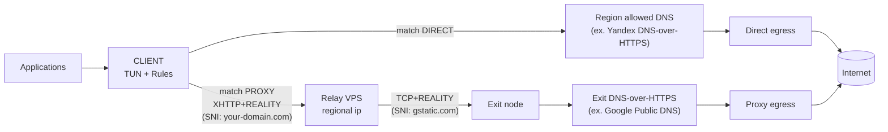

# xray-core double-hop arch

## Architecture Overview

```mermaid
flowchart LR
    APP[Applications] --> TUN["CLIENT<br/>TUN + Rules"]

    TUN -->|match DIRECT| DNS_C["Region allowed DNS<br/>(ex. Yandex DNS-over-HTTPS)"]
    DNS_C --> DIRECT[Direct egress]

    TUN -->|"match PROXY<br/>XHTTP+REALITY<br/>(SNI: your-domain.com)"| RELAY["Relay VPS<br/>regional ip"]
    RELAY -->|"TCP+REALITY<br/>(SNI: gstatic.com)"| EXIT[Exit node]
    EXIT --> DNS_E["Exit DNS-over-HTTPS<br/>(ex. Google Public DNS)"]
    DNS_E --> PROXY[Proxy egress]

    DIRECT --> NET[(Internet)]
    PROXY --> NET
```
